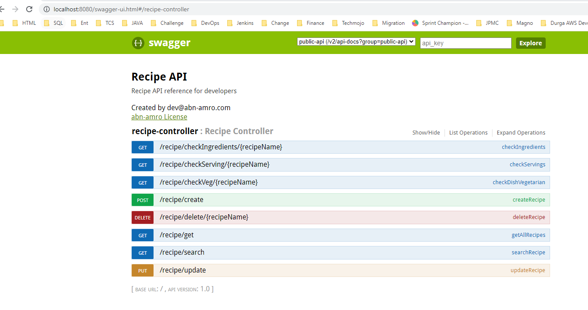

This is a micro-service to manage the recipes of the restaurant. 

<b>How to build</b>
```
mvn clean install
```

<b> How to run</b>

```
After building the application, it creates a jar file inside target directoty.

java -jar target/recipe-0.0.1.jar
```


And the micro-service is also enabled with the actuators example: http://localhost:8080/actuator/health

Service can be readily deployed with in-memory database(H2) configured

This application is Swagger enabled where you can check the documentation of the APIs.

You can access the swagger documentation using the following URL

http://localhost:8080/swagger-ui.html

